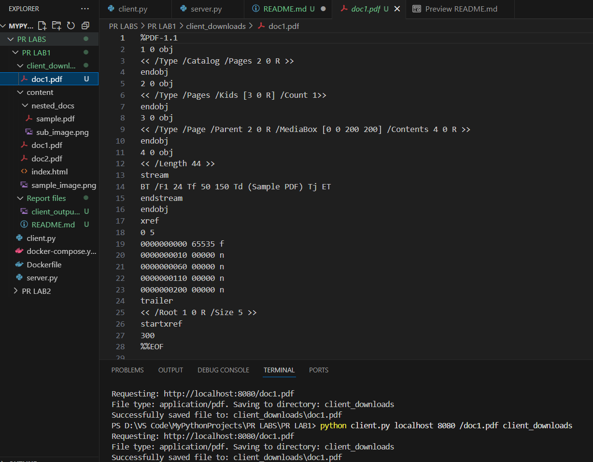
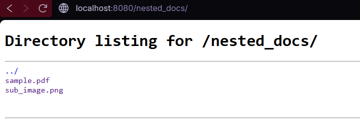
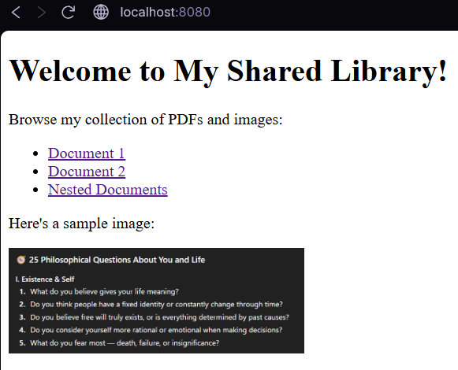
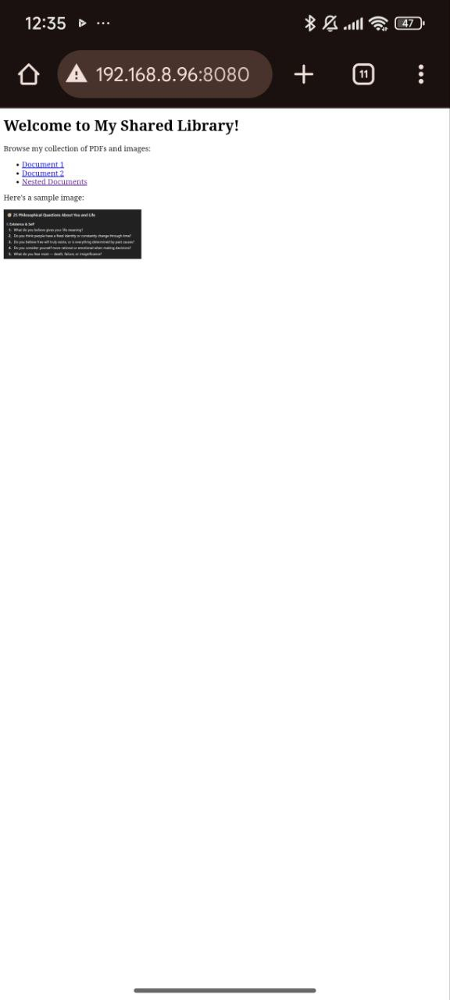

# Network Programming - Laboratory Work 1: HTTP file server with TCP sockets
## Tatarintev Denis

### 1. Project Contents
```
project_root/
├── server.py             # HTTP server implementation 
├── client.py             # HTTP client implementation 
├── docker-compose.yml    # Runs container in Docker
├── Dockerfile            # Instructions for building the Docker image
└── content/              # Directory served by the server
    ├── index.html        # Main HTML file referencing the image and PDFs
    ├── sample_image.png  # Sample image
    ├── doc1.pdf          # Sample PDF
    ├── doc2.pdf          # Sample PDF
    └── nested_docs/      # Nested directory
        ├── sub_doc1.pdf  # PDF in subdirectory
        └── sub_image.png # PNG in subdirectory
```
### 2. Docker Compose and Dockerfile
Dockerfile: This is the blueprint for building the custom Docker image. It specifies that the image should be based on Python 3.11, copies all your project files (server.py, client.py, etc.) into the container, and sets the working directory.

``` Dockerfile
FROM python:3.11-slim

WORKDIR /usr/src/app

COPY . .

EXPOSE 8080

CMD ["/bin/bash"]
```

docker-compose.yml: This file orchestrates how to run the service. It tells Docker to build the image using the Dockerfile, maps port 8000 for external access, mounts your local site/ folder as a read-only volume inside the container at /srv, and sets the startup command to execute your Python server.

```docker-compose.yml
version: "3.8"
services:
  lab1:
    build: .
    ports:
      - "8000:8000"
    volumes:
      - ./site:/srv:ro
    command: ["8000","/srv"]
```

### 3. Command that runs the server inside the container, with a directory as an argument
```powershell
docker build -t file-server-task .

docker run -d `
--name my-file-server `
-p 8080:8080 `
file-server-task `
python server.py content
```

### 4. Requests of 4 files in the browser: inexistent file (404), HTML file with image, PDF file, PNG file

HTML Request: http://localhost:8080
PDF Request: http://localhost:8080/doc1.pdf
PNG Request: http://localhost:8080/nested_docs/sub_image.png
404 error Request: http://localhost:8080/nested_docs/vhjvj

### 5. Client results


### 6. Directory listing



### 7. Friend's Server
Using ipconfig I got ip address, after that in Google search I inputted the ip_address:8080 and the server loaded
